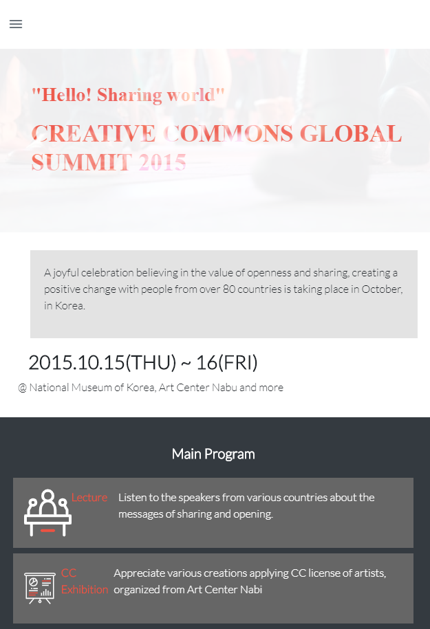
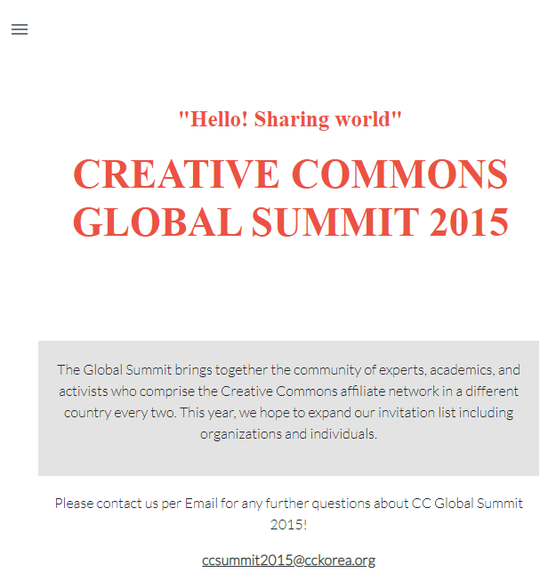
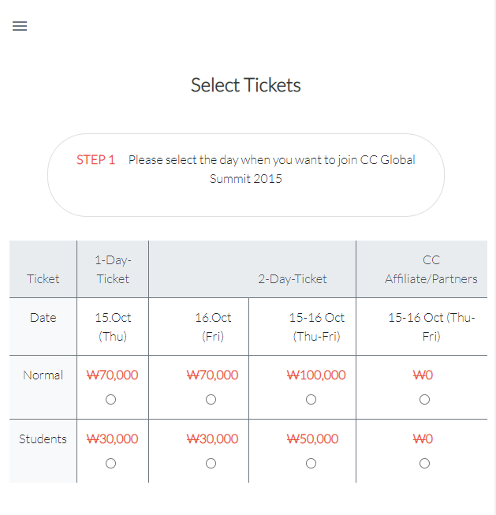
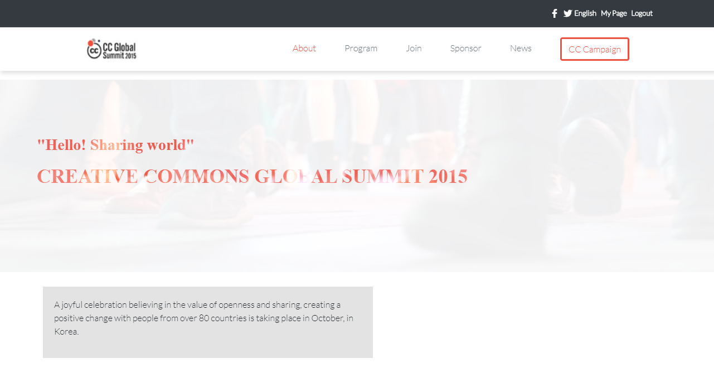
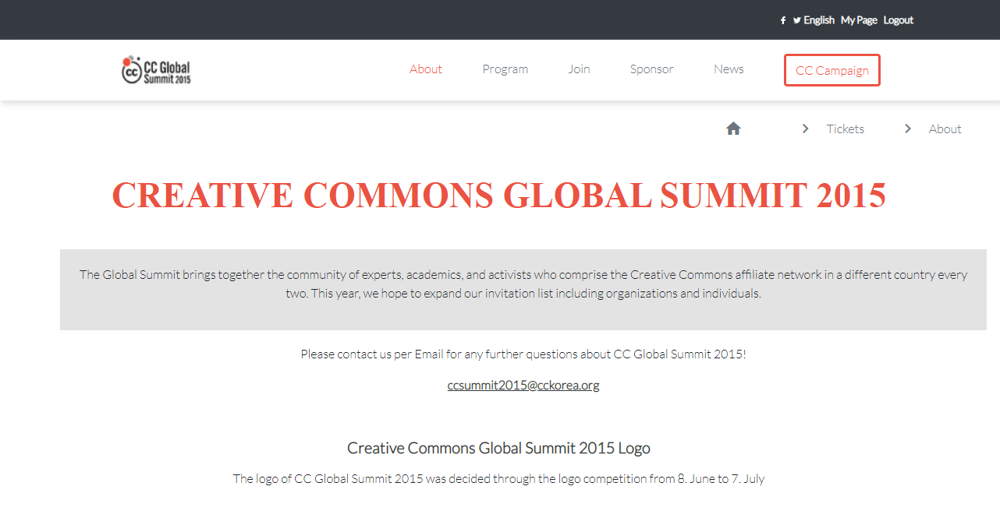
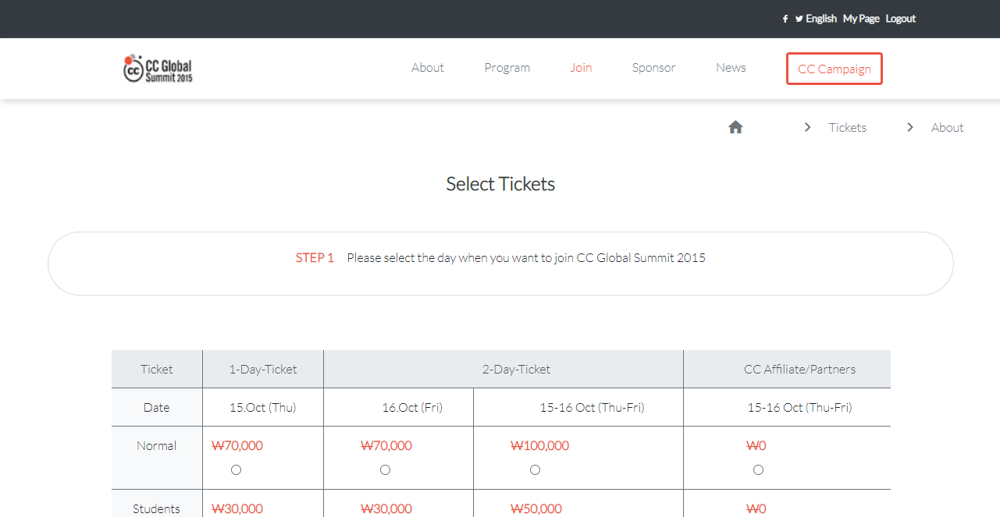

# Project 8 - HTML and CSS Capstone Project

This is a solo project where I had to replicate/clone the CC Global Summit 2015 website according to <a href="https://www.behance.net/gallery/29845175/CC-Global-Summit-2015">these specifications.</a>

## Preview of web page

### Mobile Screen

#### Main Web Page (Home page)



#### About Web Page 



#### Tickets Web Page 



### Tablet Screen, Laptop Screen and Extra Large Screen

#### Main Web Page (Home page)



#### About Web Page 



#### Tickets Web Page 



## Built With

- HTML5
- CSS3
- <a href="https://materializecss.com/icons.html">Google icons</a>
- <a href="https://www.flaticon.com/">SVG icons</a>
- <a href="https://www.logo.wine/logo/Airbnb">Company Logos in SVG format</a>
- Google Web Fonts
- Bootstrap 4
- Sass

## Live Demo

<a href="https://raw.githack.com/chelmerrox/Project-9-HTML-and-CSS-Capstone/project-draft/main.html">Live demo</a>

## My Video Presentation for this Project

<a href="https://www.loom.com/share/cb5016a9b86b46f0b63c90049ecdfd1c">My Video Presentation</a>

## Getting Started

To get a local copy up and running follow the simple steps outlined below.

## How To Use 🔧

From your command line, do the folowing steps below:
​
1. Clone the projects' repository into your machine.

```bash
# Clone this repository
$ git clone git@github.com:chelmerrox/Project-9-HTML-and-CSS-Capstone.git

```
2. Change directory/Go into the repository with the command below.

```bash
$ cd Project-9-HTML-and-CSS-Capstone

```

## Author

👤 **Losalini Rokocakau**
​
- Github: [@chelmerrox](https://github.com/chelmerrox)
- Twitter: [@chelmerrox](https://twitter.com/chelmerrox)
- Linkedin: [Losalini Rokocakau](https://www.linkedin.com/in/losalini-rokocakau)

## 🤝 Contributing

  Contributions, issues and feature requests are welcome!

  Feel free to check the [issues page](https://github.com/chelmerrox/Project-9-HTML-and-CSS-Capstone/issues).

## Show your support

Give a ⭐️ if you like this project!

## Acknowledgments

- Microverse
- <a href="https://www.behance.net/adagio07">Cindy Shin</a>, the owner and creator of the website's design.
- My Stand-Up Team
- <a href="https://github.com/BrittanyBlake">My Mentor</a>
- Microverse TSEs

## 📝 License

This project is [MIT](LICENSE.txt) licensed.